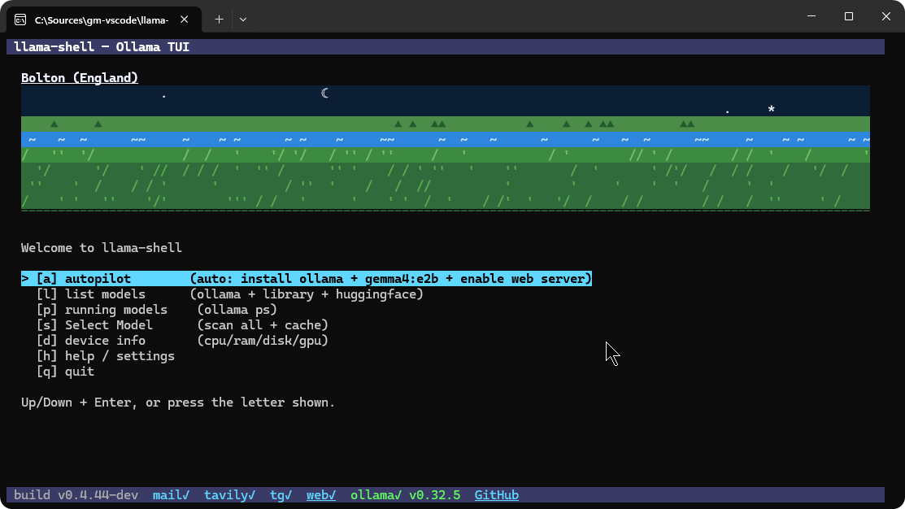

# llama-shell

[](https://github.com/affigabmag/llama-shell/releases/latest)

A terminal UI (TUI) shell for [Ollama](https://ollama.com), written in Go with 
[Bubble Tea](https://github.com/charmbracelet/bubbletea) + [Lipgloss](https://github.com/charmbracelet/lipgloss).
Single static executable, no runtime dependencies.

Talk to your local model from wherever you actually are: the terminal, a
browser tab, or Telegram on your phone — all three are the same agentic
chat, same tools, same conversation loop underneath. One-key `[a]` autopilot
gets you from a blank machine to a working chat with zero manual setup.




## Building

```
go build -ldflags "-X main.buildTime=$(date +%Y%m%d-%H%M%S) -X main.appVersion=v0.5.0" -o llama-shell.exe .
```

The footer shows `llama-shell <appVersion>` (e.g. `llama-shell v0.6.0`) when built with the `-X main.appVersion=...` ldflag; omit it (as a plain `go build .` does) and the footer falls back to `build <timestamp>` instead. `appVersion` also drives the self-update checker — set it to match the git tag you're cutting the release from, or the checker can never tell if a newer release exists.

## Running

```
./llama-shell.exe
```

### Command-line flags

`llama-shell --help` (also `-h`, `/help`, `/?`, `-?`) prints usage and exits — no flags needed for the normal interactive menu.

| Flag | Effect |
|---|---|
| `--autopilot` | Skip the menu: check Ollama is installed (opens the installer page if not), pull `gemma4:e2b` if missing, enable + start the web server, then drop straight into the agentic chat with it — the same flow as pressing `[a]` in the main menu. |
| `--minimized` | Start normally, but minimize the console window right away (Windows only) — for launching from a startup script without popping up. |
| `--tools` | List every agent tool, grouped by category, and exit. Reads from the exact same list the TUI's `Alt+T` browser and the web UI's Tools panel use, so all three can never drift apart. |
| `--tools-extended` | Same, but numbered and with the two example prompts shown per tool (matches the TUI's `Alt+T` detail view). |
| `--log [N]` | Print the last `N` activity log lines, oldest first (default 100 if `N` is omitted), and exit — same log the TUI's `[h]` → `[g]` screen and the web UI's log panel read. |
| `--export-backup [path]` | Export every setting (email, telegram, tavily, web server, auto-update, disclaimer, etc.) to an encrypted `.lsb` file and exit. Path defaults to `<home>/llama-shell-backup.lsb`. Same feature as `[h]` → `[x]` in the menu. |
| `--import-backup <path>` | Import settings from a `.lsb` file made by `--export-backup` (or `[h]` → `[x]`) and exit — overwrites current settings. |

## Layout

- **Header** (fixed top): app title.
- **Footer** (fixed bottom): purple bar matching the header, left-aligned end to end. Build version (left), then status flags — `mail`/`tavily`/`tg`/`web` (grey=off, yellow=configured-but-not-running, cyan=running/bound/set, shown only for mail once configured), `ollama` installed/not-installed with version (green if installed, red if not, preceded by a blinking yellow `update` flag when a newer release is available) — and a clickable "GitHub" repo link (OSC-8 terminal hyperlink) at the end. In scrollable/chat screens the right side shows a context-specific key hint instead.
- **Body**: the current screen. All menus support Up/Down + Enter navigation as well as the letter shortcut shown in brackets.
- **Banner**: an animated ASCII scene at the top of the main menu, regenerating every 15s to a pseudo-random walk through 1400+ real world cities/towns (name + country shown above it, clickable through to a Google Images search). Larger world capitals get a colored skyline (unique golden-angle hue per building, static symmetric window grid, slow-blinking stars); smaller towns get a countryside scene (sky, sun/moon, tree line, a flowing river band, grass). Both switch between a day and night look based on the real current time in that place's country.

## Main menu

| Key | Screen |
|---|---|
| `a` | Autopilot — see below |
| `l` | List models |
| `p` | Running models |
| `s` | Show model info |
| `d` | Device info |
| `h` | Help |
| `q` | Quit |

### Autopilot (`a`)

One key from a blank machine to a working chat: checks Ollama is installed (opens the installer page and asks you to relaunch if it isn't — Windows/macOS have no scriptable silent installer, same limitation as the setup wizard below), pulls `gemma4:e2b` if it isn't already local, enables and starts the web server with it, then drops straight into the TUI's own agentic chat with that model. `Esc` from that chat returns to the main menu instead of the "show model info" table, since nothing's been scanned yet. Same flow is available headless via `llama-shell --autopilot`.

On first launch, the app shows the disclaimer and requires `[a] I agree` before continuing — declining (any other key) quits the app. If Ollama isn't installed, it then offers to install it: Linux runs the official one-line installer unattended, macOS/Windows open the correct download page (those are signed GUI installers, not scriptable).

### List models (`l`)

Queries three sources every time it's opened (no cache — always fresh):

- **ollama** — locally installed models, via `ollama list`.
- **ollama-library** — the full public catalog scraped from `ollama.com/library` (~235 model families). Size shown is the available parameter sizes (e.g. `2b,7b,72b`), since the index page doesn't expose download size.
- **huggingface** — top 50 GGUF repos by downloads, via the public HF API. (HF hosts 100k+ GGUF repos — this is a slice, not the whole catalog.)

Columns: `NAME`, `SOURCE`, `LOCAL` (installed y/n, cross-referenced against the ollama source), `SIZE`, `CAPABILITIES` (via `ollama show`, e.g. `completion,vision,tools` — only populated for installed/`ollama`-source rows; library/HF entries show `-` since there's nothing to introspect until they're pulled).

Controls:
- Type to filter/search the list live.
- Up/Down to select, Enter to download (or shows "already installed" if local).
- Selecting an `ollama-library` entry with multiple parameter sizes opens a size picker first.
- Downloads show a real streaming progress bar (parsed from `ollama pull`'s own output — its raw ANSI/bar characters are stripped and the line is rebuilt from just label/percent/size/speed/eta) with `[c]` to cancel mid-download.
- `ctrl+r` to force a rescan.

### Running models (`p`)

Live `ollama ps` output, scrollable/selectable. Enter on a row asks to confirm, then stops that model (`ollama stop`). `r` to refresh.

### Show model info (`s`)

Runs `ollama show` against every locally installed model (progress bar while scanning) and caches the result (`%LocalAppData%\llama-shell\models_cache.json`) so it loads instantly next time. `r` forces a rescan ignoring the cache.

Table columns: `NAME`, `PARAMS`, `QUANT`, `CONTEXT`, `ARCH`, `SIZE`, `CAPABILITIES` (via `ollama show`'s "Capabilities" section, e.g. `completion,vision,audio,tools,thinking` — tells you at a glance whether a model is chat-only, multimodal, or tool-calling capable), `CPU/GPU`, `MATCH%` (the last two come from the benchmark — see below; `-` until you've run it).

Enter on a row opens an action menu:
- `[a]` run own agentic chat — see below, listed first.
- `[x]` run interactively — hands the terminal to `ollama run <model>` for a real chat session.
- `[r]` remove — `ollama rm`.
- `[k]` kill/stop — `ollama stop`.

The list is also automatically invalidated (forced rescan) the next time you open it after downloading a new model from the List models screen, so newly pulled models show up right away instead of a stale cached list. Cache entries from before the `CAPABILITIES` column existed won't have it populated until you press `r` to force a rescan.

### Agentic chat (`a` from Show model info)

llama-shell's own built-in chat + tool-calling agent — no Aider/OpenCode/Claude Code needed, talks to Ollama's `/api/chat` directly.

- **Streaming replies**: parses Ollama's newline-delimited JSON stream chunk-by-chunk, so replies type out token-by-token instead of appearing all at once. A stream that gets cut off mid-generation without a final `done:true` (e.g. the backend crashed) surfaces as a real error instead of silently looking like an empty, successful reply.
- **Model warm-up status** shown in the banner: `○ waiting for model to finish loading...` while a background `ollama ps` poll hasn't seen it yet, flipping to `● model loaded and ready` the instant a real token, tool call, or completed turn arrives — typing is never blocked either way, this is purely informational for a cold-loading model that can otherwise look like the app is frozen. Once loaded, a background check every 10 minutes re-confirms via `ollama ps` that the model is still actually resident and silently reloads it (`ollama run <model> hi`, fire-and-forget) if Ollama's own idle timeout unloaded it — skipped whenever a turn is already in flight.
- **62 tools** across files & archives, shell & processes, networking & web (`web_search` via a DuckDuckGo HTML scrape — no API key; `read_webpage`; `rss_feed`/`find_rss_feed` for structured headlines from a feed, discovered via a page's `<link rel="alternate">` tag rather than a guessed URL; `tavily_search`/`tavily_extract` when a Tavily key is set — see below; `get_stock_quote` for a live stock/index price straight from a JSON API covering dozens of world indices by name, no scraping or consent walls; `get_web_ui_url` for the browser URL, LAN IPs included; `send_email` through the configured Gmail account — see below; `http_post`/`download_file`), system & environment (including `send_notification`/`read_registry`), git & ollama (including `git_commit`/`git_branch`/`pull_ollama_model`), vision & media (`take_screenshot`/`view_image`/`read_pdf`/`read_document`), data (`run_sql`/`read_csv`/`read_json`), and open/launch. Press **Alt+T** to browse the full list — numbered, grouped by category, `Tab`/`Shift+Tab` to select and auto-scroll, `Enter` for a detail view (real description + two example prompts), `Esc` back. The exact same list is what `--tools`/`--tools-extended` print from the command line.
- **Right-to-left support**: Hebrew/Arabic input reorders live as you type (cursor at the left edge of the RTL span, not trailing at the end) and replies/history right-align instead of sitting flush-left; embedded digits inside an RTL word keep their own left-to-right order instead of getting character-reversed along with the letters around them.
- **Per-reply timing**: every reply — in the TUI, the web UI, and Telegram — ends with `⏱ 56s` (or `1m 04s` past a minute), so a slow local model's actual turn time is always visible, not just guessed at from a spinner.
- **Vision**: type/paste a path to an existing image file, or press **Alt+V** to attach an image straight from the clipboard (falls back to pasting clipboard text if there's no image) — both base64-attach via Ollama's `images` field.
- **Tool mode (`Alt+M`)**, cycles `auto` (default) → `on` → `off`, shown live in the footer. `auto` skips tool-calling for any single message that attaches an image — at least `gemma4:e2b` garbles the image entirely when `tools` is also in the request, so a message can reliably have working vision or working tools, not both — then resumes tools on the next image-free message. `on` always tries tools anyway; `off` never sends them this chat.
- **Keys**: `Enter` send, `Up`/`Down`/`PgUp`/`PgDn`/`Home`/`End` scroll history (via a real `bubbles/viewport`, works even while the model is thinking), `Alt+V` paste, `Alt+T` tool categories, `Alt+M` cycle tool mode, `Alt+H` this keybind help dialog, `Esc` back to the model actions menu, `Ctrl+C` quit. `Alt+` instead of `Ctrl+` deliberately — browser-based terminals (e.g. viewing an LXC console over the web) often reserve `Ctrl+T`/`Ctrl+H`/`Ctrl+R`/`Ctrl+V` for tab/history/reload/paste at the browser level and never forward them to the app.
- **Fixed layout**: the transcript viewport fills the space between the header and the input line; `you>` always sits exactly 3 rows above the very bottom (footer, one blank line, `you>`), regardless of conversation length or scroll position — the viewport's own output is manually padded to its declared height before being placed, since `bubbles/viewport` doesn't pad short content itself, and a global `clampToLastLines` safety net in `View()` guarantees no single frame can ever exceed the terminal's actual height (an earlier bug let a huge streamed reply overflow the frame, which permanently desynced the terminal's scroll position from bubbletea's cursor tracking until restart — the header would just vanish).
- **`you>`/`modelName>` prefixes are colored, message bodies are grey** — the prefix is what tells you who's speaking, the text itself doesn't need to compete with it.
- Tool-calling reliability depends entirely on the model — small/local models can refuse or hallucinate. The system prompt explicitly tells the model it has real file/system access and that tools are additive to normal conversation, not a replacement for it, after early tests showed models either refusing everything ("I'm just an AI") or refusing *everything else* once tools were mentioned ("I can only do file ops").

### Device info (`d`)

Static machine info: OS/arch, CPU model, logical core count, RAM, per-drive used/total space, GPU(s). Cached to disk (`device_cache.json`) so it's instant on repeat visits; `r` forces a rescan and refreshes the cache.

`b` — **benchmark all installed models**. This is the CPU/GPU-suitability scan:

1. Shows a red warning + `[y]/[n]` confirm (it loads and unloads every model, one at a time — can take a long time).
2. Models are benchmarked **smallest-first** (by size), so cancelling partway through still yields the most data points.
3. For each model: `ollama run <model> hi` (load + time it), read its live CPU/GPU split from `ollama ps`, `ollama stop` it, move to the next.
4. Progress bar + a live-growing results table (NAME / CPU-GPU / MATCH%) shown as each model finishes.
5. `[c]` cancels mid-run (kills the current model's process); whatever was measured so far is still saved to cache and shown on the cancellation screen.
6. Results are written into the same cache `show model info` reads, so its `CPU/GPU` and `MATCH%` columns populate from this pass.

**CPU/GPU column format**: since the column header already says "CPU/GPU", raw ollama output like `100% GPU` is shown as `100g`; `100% CPU` as `100c`; a genuine split like `44%/56% CPU/GPU` as `44/56` (order matches the header, no unit labels needed).

**Match score** (0-100%): `0.7 × GPU-share + 0.3 × load-speed-score` (load speed scored against a 30-second-to-zero heuristic). Higher = better fit for this machine.

### Update (`u` from the help menu)

Checks `github.com/affigabmag/llama-shell`'s latest release on every startup and shows a blinking `update` flag in the footer (left of the ollama status) if a newer one is available for your OS/arch. Open `[u] update` from the help menu to see current vs. latest version and press `[u]` to download and install, or `[r]` to re-check.

Self-update mechanism (differs by OS since a running executable can't be freely overwritten):
- **Linux/macOS**: downloads the release zip, extracts the binary, and does one atomic rename over the running executable's file — allowed even while it's running.
- **Windows**: a running exe can't be renamed *onto*, but *itself* can be renamed — so it renames the running exe aside to `<exe>.old`, then renames the newly-downloaded binary into place. The leftover `.old` file is cleaned up automatically on the next launch.

**Auto-update**, on the same screen: a background daemon wakes once a day at a configurable time (default 3:00 AM, `[t]` on this screen to change it) and, if a newer release exists and this is enabled (`[e]`/`[d]`), downloads it, swaps it in, quits the TUI cleanly, and relaunches the new binary automatically — no confirmation prompt, since it's meant to run unattended.

### Activity log (`g` from the help menu)

The same activity log every action in this app writes to (`%LocalAppData%\llama-shell\activity.log`, unbounded on disk). The viewer shows the last 5000 events, newest first; press `/` to search (filters live, `Enter` locks the filter in, `Esc` clears it) — the search box is always visible in the footer so it can't scroll out of view. The web UI's burger menu has the same searchable log panel (`/api/logs`); `llama-shell --log [N]` prints it from a plain shell, oldest first.

### Setup wizard (`w` from the help menu)

A guided first-time setup: accept the disclaimer, install Ollama if it's not already on `PATH`, choose which starter models to pull — `qwen2.5:1.5b` (~1 GB), `gemma2:2b` (~1.6 GB), `gemma4:e2b` (~7 GB) — then yes/no on setting up Tavily, Telegram, and Email, chaining through whichever of those three you say yes to in order once the main wizard finishes. Every question is asked up front (skipping the Ollama-install question entirely if it's already installed); only after all of them are answered does anything actually start. `[esc]`/`[q]` cancels at any point during the questions, `[esc]`/`[a]` aborts the currently-running install/download without touching what's left unselected. Declining the disclaimer question quits the app immediately — and clears any earlier acceptance, so the next launch asks again from scratch, exactly like it never having been accepted at all.

Before starting any download, it checks real free disk space on the drive Ollama actually stores models on (`~/.ollama/models`, or `$OLLAMA_MODELS` if set) against the combined size of everything selected plus a 20% margin — if there isn't enough room, it stops before downloading anything and says how much space is missing, rather than failing partway through a multi-gigabyte pull.

Either way, you need to restart llama-shell afterward to run the new version — the update swaps the file on disk, it doesn't reload the already-running process. Requires the binary to have been built with `-X main.appVersion=vX.Y.Z` matching a real release tag (see Building); otherwise there's no baseline version to compare and the checker never reports an update.

### Web UI (`b` from the help menu)

Serves the same agentic chat — same tools, same system prompt, same conversation loop — as a page in any browser instead of only in the terminal.

- Binds **all** network interfaces, not just `127.0.0.1` — reachable from a phone or another machine on the same WiFi/LAN, not from outside it (no tunnel is set up). Every request needs a random access token baked into the URL (shown once enabled, plus a `get_web_ui_url` agent tool that lists every reachable address — loopback and every LAN IP) — without it every request gets a 403. The API underneath grants full local tool access (files, commands, network), so the token is the actual gate, not the network binding.
- Enabling picks a model: your last choice if still installed, else `gemma4:e2b`, else whatever else is installed; offers to download `gemma4:e2b` if nothing's installed at all.
- Modern chat layout (full-width messages, real markdown rendering, collapsible tool-call trace per turn, per-reply elapsed time) rather than a terminal-styled page — built after research into how Claude.ai/ChatGPT/Open WebUI actually lay out an agentic chat, not a straight skin of the TUI.
- Mobile: GitHub/Tools/Help/Logs fold into a burger menu, status badges wrap onto their own row below the brand — nothing overflows off-screen on a narrow viewport.
- Tool browser (search, grouped by category, collapsed by default, copy-to-clipboard on each example prompt, collapse-all/expand-all), a searchable activity-log panel, and a help panel, all reachable from the top bar/burger menu.
- Status badges (build version, ollama/Tavily/Telegram/mail) and a rotating "thinking"/"loading model" indicator so a slow local model never just looks stuck.
- The composer has a stop button that aborts an in-flight reply client-side.
- Port defaults to `8787`; `[p]` on the settings screen changes it (1-65535) — applies immediately if the server's already running, otherwise on next enable.

### Telegram bot (`m` from the help menu)

Same agentic chat again, reachable from Telegram on your phone.

- Uses long-polling (`getUpdates`), not an incoming webhook — no public URL, no port forwarding, no tunnel, unlike the web server option. This is also why Telegram was picked over WhatsApp: WhatsApp's Cloud API needs a public HTTPS endpoint, and the unofficial alternative (Baileys) risks the account getting banned.
- Get a token from [@BotFather](https://t.me/BotFather) (`/newbot`), paste it into the settings screen. It auto-binds to whichever chat messages it first and ignores every other chat after that, so a stranger who finds the bot's username can't drive your local agent.
- Sends an instant "Got it — working on it..." acknowledgment plus Telegram's native "typing..." indicator (kept alive on a ticker), then a "Still working on it... (Nm)" note every minute on a long turn, and finally the reply with `⏱ <elapsed>` appended — a slow model never reads as a dead bot. A message sent while a previous one is still being answered gets an immediate "please wait, I'll get to this one right after" instead of silently queuing with no acknowledgment.
- Once configured, the settings screen shows a masked summary (`● configured`) instead of the raw token — `[r]` to reconfigure.
- Token, bound chat, and model persist across restarts (`%LocalAppData%\llama-shell\telegram_config.json`).

### Tavily API key (`t` from the help menu)

Tavily ([tavily.com](https://www.tavily.com/)) is a search + scraping API built for agents. Setting a key here (get one at [app.tavily.com](https://app.tavily.com/)) enables `tavily_search` (real result content, not just snippets) and `tavily_extract` (clean article text — handles pages `read_webpage` can't: cookie walls, JS-only shells). Nothing else needs it; skip the screen if you don't want it. Once set, the screen shows a masked summary with `[r]` to reconfigure, same pattern as email/Telegram below.

### Email (`e` from the help menu)

Lets the agent send email through a Gmail account, via `send_email` (only `to` and `subject` are required — body is optional).

- Uses an **App Password**, not your real Gmail password — the screen links straight to turning on 2-Step Verification and generating one at [myaccount.google.com/apppasswords](https://myaccount.google.com/apppasswords). SMTP host/port (`smtp.gmail.com:587`, STARTTLS) are fixed, not asked for — there's only one correct value.
- Address, an optional display name (shown as the `From:` name on sent mail), and the app password — `Tab`/`Enter` cycle through the three fields.
- Saving immediately sends a real test email to the same address to confirm it actually works, and reports success/failure.
- Once configured, shows a masked summary (`Gmail address`, `Display name`, `App password: XXXXXXX`) with `[r]` to reconfigure; the footer shows `mail✓` once set up.
- Chained into the setup wizard (`w`) as a yes/no question alongside Tavily and Telegram.

### Backup / restore (`x` from the help menu)

Exports every setting in the app (email, telegram, tavily, web server, auto-update, disclaimer acceptance, etc.) into one encrypted `.lsb` file, or restores them from one made earlier.

- `[e]` export, `[i]` import — both open an in-terminal directory browser (Up/Down + Enter to navigate, no OS GUI dialog) instead of making you type a path by hand.
- AES-256-GCM, key derived via PBKDF2 from a fixed passphrase baked into the app — no password prompt, nothing to remember or lose. This protects the file from casual viewing/editing if opened directly, not from someone with this app's own source code.
- Also available from the command line: `--export-backup [path]` / `--import-backup <path>` (see Command-line flags above).
- Restoring a backup restores the disclaimer-accepted marker too, so llama-shell doesn't re-show the first-run disclaimer gate on a machine that already accepted it in the exported backup.

## Staying reachable

While running, llama-shell asks the OS not to sleep or turn the display off (Windows `SetThreadExecutionState`, macOS `caffeinate -w <pid>`, Linux `systemd-inhibit` if present) — otherwise the machine sleeping mid-session silently takes the web server and Telegram bot offline with no warning. Tied to the process itself, so it releases automatically on exit; no separate cleanup needed.

## Known limitations

- GPU detection for the benchmark's CPU/GPU split comes from `ollama ps`, which only reports an aggregate percentage — it doesn't distinguish which physical GPU on a multi-GPU machine. On Windows, ollama only has a CUDA backend, so in practice "GPU" always means the NVIDIA card if present; integrated GPUs (Intel, etc.) are listed in Device Info but never used by ollama.
- Only ollama + Hugging Face are treated as real model sources. LM Studio, llama.cpp, koboldcpp, text-generation-webui etc. don't maintain their own catalogs (they all consume HF), so they'd just be aliases for the same HF listing. GPT4All does have its own catalog but runs through a different engine entirely — it's not wired up here since none of this app's actions (`run`/`kill`/`remove`) would work against it.

## License

Source-available, view-only — see [LICENSE](LICENSE). You can read the code and run it for personal use, but you may not modify it or redistribute a modified version. Provided with no warranty of any kind. Not affiliated with or endorsed by Ollama Inc. or Hugging Face. On first launch, the app requires you to accept this disclaimer before continuing (`[h] help` in the main menu to review it again later).
